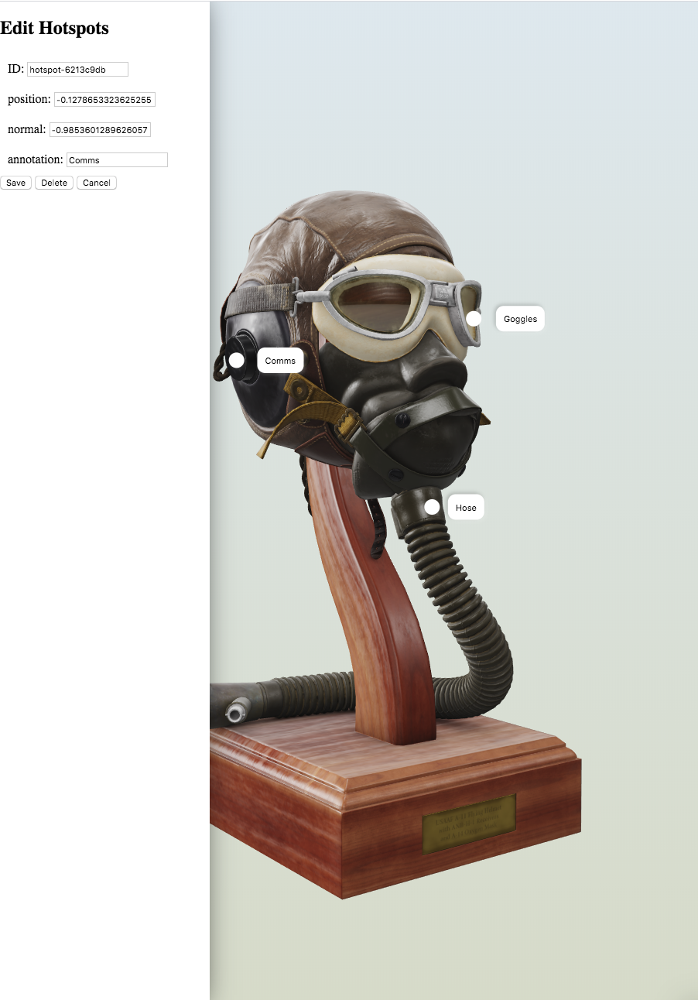

# Model Viewer Studio

A CLI for authoring 3D models using the `model-viewer` web component. [https://modelviewer.dev/](https://modelviewer.dev/)



## Usage

Create an HTML file that contains a model-viewer element.

```bash
touch index.html
```

Add the following html to the `index.html`.

```html
<!DOCTYPE html>
<html lang="en">
  <head>
    <meta charset="UTF-8" />
    <meta name="viewport" content="width=device-width, initial-scale=1.0" />
    <meta http-equiv="X-UA-Compatible" content="ie=edge" />
    <title>FlightHelmet</title>
    <style>
      model-viewer {
        width: 100%;
        height: 100%;
        position: absolute;
      }

      button {
        display: block;
        width: 20px;
        height: 20px;
        border-radius: 10px;
        border: none;
        background-color: white;
        box-sizing: border-box;
        box-shadow: 2px 2px 5px rgba(255, 255, 255, 0.1),
          -2px -2px 5px rgba(0, 0, 0, 0.1);
      }

      #annotation {
        background-color: white;
        position: absolute;
        transform: translate(50%, -50%);
        border-radius: 10px;
        box-shadow: 2px 2px 5px rgba(255, 255, 255, 0.2),
          -2px -2px 5px rgba(0, 0, 0, 0.2);
        padding: 10px;
        opacity: 0;
      }

      [data-visible] #annotation {
        opacity: 1;
      }

      x-toolbar {
        position: absolute;
        z-index: 50;
      }

      body {
        padding: 0;
        margin: 0;
        background-image: linear-gradient(to top, #dbdfcf 0%, #e2ebf0 100%);
      }
    </style>
  </head>
  <body>
    <model-viewer
      src="https://rawcdn.githack.com/KhronosGroup/glTF-Sample-Models/cf15d02ec26d76b3bf27fd48297961ebd068f296/2.0/FlightHelmet/glTF/FlightHelmet.gltf"
      auto-rotate
      camera-controls
      ar
      autoplay
      preload
    >
    </model-viewer>

    <script
      type="module"
      src="https://unpkg.com/@google/model-viewer/lib/model-viewer.js?module"
    ></script>
    <script
      nomodule
      src="https://unpkg.com/@google/model-viewer/dist/model-viewer-legacy.js"
    ></script>
  </body>
</html>
```

Run the model-viewer-studio app using `npx` (requires node version 10 or higher).

```bash
npx model-viewer-studio index.html
```